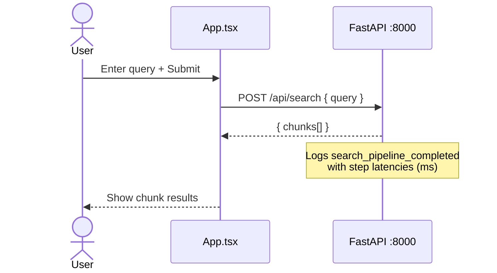
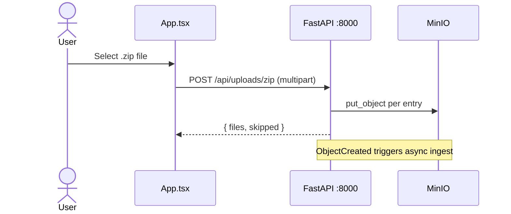
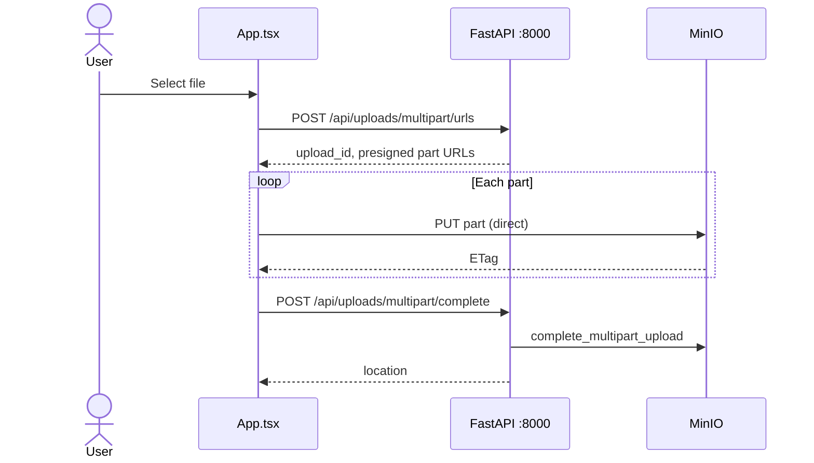
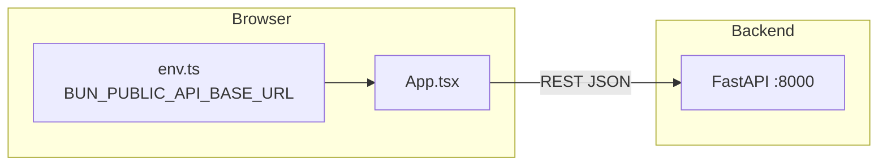

# Enterprise RAG — Frontend

Web UI for the [Enterprise RAG](../README.md) project: upload documents and search ingested chunks against the FastAPI backend.

Built with **Bun**, **React**, and **Tailwind CSS**.

## UI flows

### Search



### Zip upload



### Multipart upload (large files)





## Features

- **Zip upload** — send a `.zip` archive to `POST /api/uploads/zip`
- **Large file upload** — S3 multipart flow via presigned URLs (`/api/uploads/multipart/*`)
- **Search** — query ingested chunks via `POST /api/search`

## Debugging search latency

The API logs each search to stdout and `logs/enterprise-rag.log` as **`search_pipeline_completed`** with `total_ms` and per-step timings (`embed_ms`, `vector_ms`, `fusion_ms`, etc.).

After searching in the UI:

```bash
docker logs enterprise_rag 2>&1 | grep search_pipeline_completed
```

See [Search observability](../README.md#search-observability) in the root README for all log fields and tuning (`SEARCH_ENABLE_RERANK`, cache TTLs).

## Run with Docker (recommended)

From the repository root:

```bash
docker compose up --build frontend
```

Open http://localhost:3000. The container sets `BUN_PUBLIC_API_BASE_URL=http://localhost:8000` so the browser talks to the API on the host.

Ensure the full stack (API, worker, Postgres, Redis, MinIO) is running — see the [root README](../README.md).

## Local development

### Prerequisites

- [Bun](https://bun.sh) v1.3+
- Backend API running at http://localhost:8000 (or your chosen base URL)

### Install and run

```bash
cd frontend
bun install
bun dev
```

Dev server: http://localhost:3000 (default Bun dev port; check terminal output).

### API base URL

The client reads the API base from `BUN_PUBLIC_API_BASE_URL` (see `src/env.ts`). For local dev without Docker:

```bash
export BUN_PUBLIC_API_BASE_URL=http://localhost:8000
bun dev
```

### Production build

```bash
bun run build
bun start
```

## Project layout

```text
frontend/
├── src/
│   ├── App.tsx          # Upload + search UI
│   ├── env.ts           # API base URL from environment
│   └── components/ui/ # Shared UI primitives
├── Dockerfile
└── package.json
```

## Related documentation

- [Root README](../README.md) — architecture, Docker setup, search pipeline, observability, API reference
